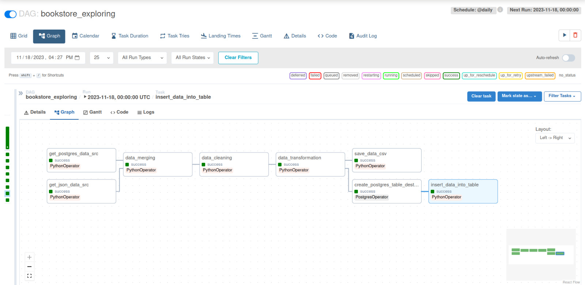

# BookStore ETL Data Pipeline using Airflow

## Project Overview
This data project involves creation of an ETL pipeline utilizing Airflow that extract information from PostgreSQL and a JSON file. After extracting, the data undergoes transformations, including validation checks, deduplication, and removal of unnecessary entries. A new database table is created to store the transformed data, which is then loaded into this table. The final step involves saving the processed data into a CSV file.

The data is for a bookstore that pertains to books available online and provides valuable insights into a collection of books, encompassing various genres, pricing structures, and reader feedback. Each entry in the dataset offers a glimpse into the rich tapestry of the literary world.

## Data Source
> link on kaggle: https://www.kaggle.com/datasets/bishop36/bookstore/

## Project Tasks
* Extract the data from the vrious sources: PostgreSQL Database - JSON file.
* Transform the data including check validations, remove duplicates, and remove useless data.
* Create a database table to hold the transformed data.
* Load the transformed data into the created table.
* Save the data into CSV file.

## Result Snapshot 

